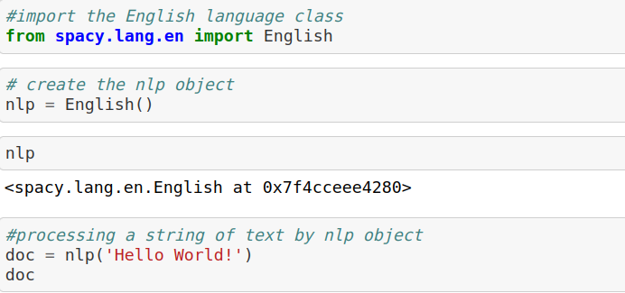
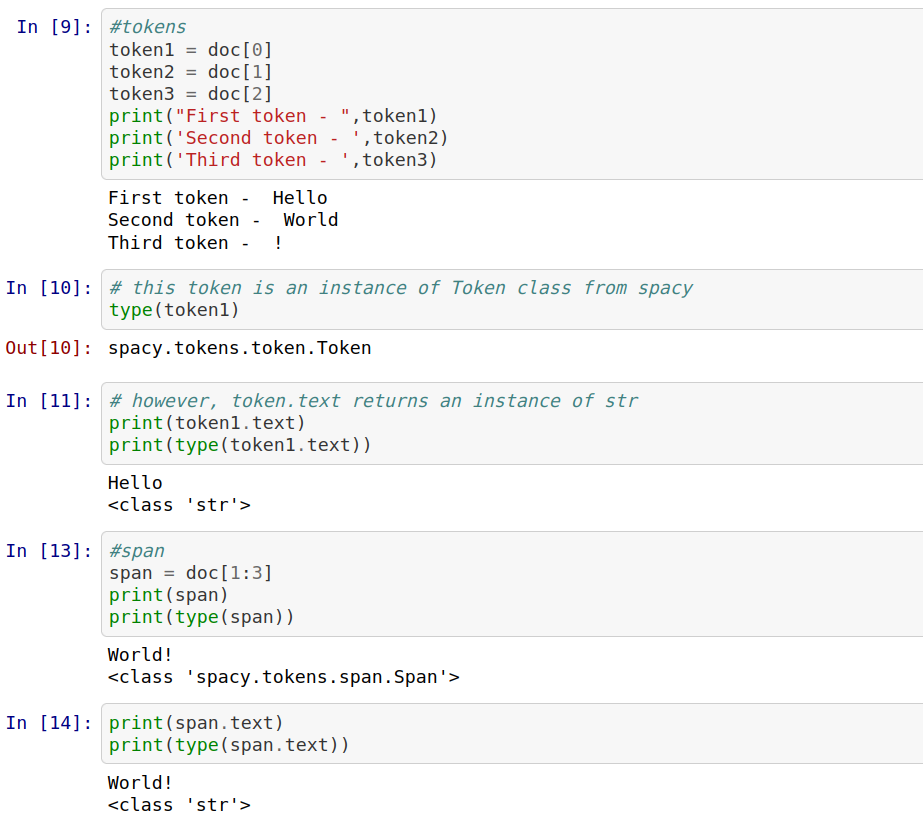
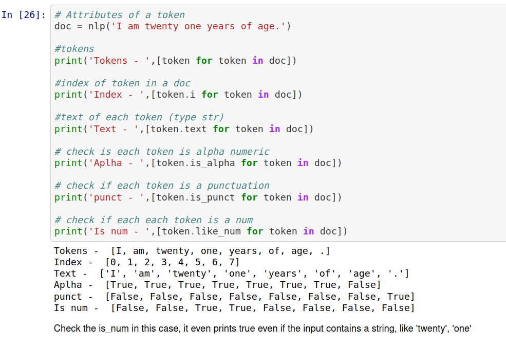
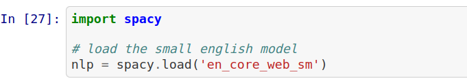
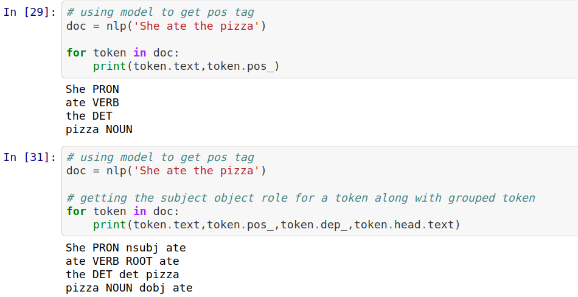
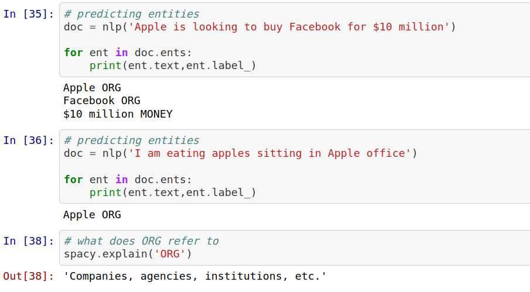

# Advanced NLP with Spacy 

## Chapter 1
- Creating nlp object
  - The first step is to create an nlp object
  
  
- Tokens and span
  - Tokens are the characters inside the nlp object 
  - Token are accessed by using index - doc[0]
  - Span are accessed by using slices - doc[2:5]
   
   
- Attributes of token
  - There are many built in function that can be used on tokens
    
    
- Using Statistical models
   - Loading statistical model
      
   - Pos tagging using stats model
      
    - Entity recognition using stats model
      
   
 - Matching patterns
  - Spacy matcher is better then using regex because it allows much complex search, we can even search for verbs, 
   
